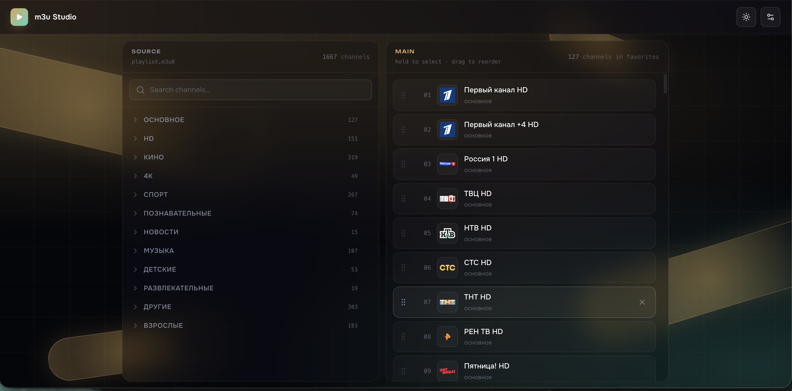

# m3u Studio

> Local web studio for curating, previewing, and exporting m3u/m3u8 IPTV playlists.

[](https://github.com/stepanovandrey89/m3ustudio/actions/workflows/ci.yml)
[](./LICENSE)
[](https://www.python.org/)
[](https://fastapi.tiangolo.com/)
[](https://react.dev/)
[](https://www.typescriptlang.org/)
[](https://tailwindcss.com/)
[](./Dockerfile)
[](https://github.com/awesome-selfhosted/awesome-selfhosted)



A self-hosted playlist editor with drag-and-drop reordering, live HLS preview,
integrated EPG, automatic logo resolution, duplicate detection, and one-click
export to a cleaned-up `.m3u8` file.

Built as a small, fast, local-first tool: one `docker compose up` (or
`./run.sh`) and you have a FastAPI backend + React 19 frontend running on
your machine.

---

## Features

**Editing**
- Drag-and-drop channels between the source panel and the curated main list
- Multi-select with hold-to-select, bulk remove, bulk reorder
- Rename groups, move channels between groups, delete channels
- Inline search with substring + tvg-id matching
- Autosave on every change — no save button

**Playback**
- Built-in HLS player (`hls.js`) with archive / catchup support
- Keyboard shortcuts: `←/→` prev/next channel, `Space` play/pause, `F` fullscreen, `G` toggle EPG
- Optional AC-3 → AAC transcode fallback via ffmpeg for channels whose audio Safari/Chrome refuse to decode
- Now-playing overlay driven by EPG data
- Record-to-MKV from the player

**EPG**
- Downloads and caches an XMLTV guide (default: `epg.it999.ru/edem.xml.gz`)
- Shows a scrollable programme list per channel with Today / Yesterday / Tomorrow day headers
- Click any programme to jump to its archive position

**Logos**
- Automatic resolution from `iptv-org/database`, `tv-logo/tv-logos`, and EPG icons
- On-demand background warming at startup, cached to `logos_cache/`
- Drop-in override: any PNG named after a channel slug takes precedence

**Organisation**
- Mirrored "Основное" group between the source file and the curated main list — edit either side and the other follows
- Configurable default channel order (editable via Settings) used as the bootstrap seed for fresh imports
- Duplicate detection that groups near-identical channel names across providers
- Import / export: upload a new `.m3u8`, download the curated one, export just the channel names as `.txt`

**UI**
- Dark and light themes, toggleable from the header
- Responsive: desktop two-panel layout with `@dnd-kit`, mobile tab bar
- Glass morphism on dark, opaque cream-white panels on light
- Decorative animated background, mouse-follow glow, grid overlay

---

## Quick start

### 🐳 Docker (recommended)

```bash
git clone https://github.com/stepanovandrey89/m3ustudio.git
cd m3ustudio
docker compose up -d
```

Open http://127.0.0.1:8000 — that's it. Your playlist, state and all
caches are persisted under `./data/` next to the compose file.

Drop your `.m3u8` file into `./data/playlist.m3u8` (or upload it from the
UI via Settings → Import playlist) and start editing.

Stop with `docker compose down`.

### 💻 Local dev

Requires Python 3.12+, `pnpm`, and (optionally) `ffmpeg` for audio transcode fallback.

```bash
./run.sh
```

This bootstraps a `.venv`, installs backend + frontend deps, and launches
both processes. When it's ready, open:

- Frontend → http://127.0.0.1:5173 (or `http://<your-LAN-ip>:5173`)
- API → http://127.0.0.1:8000

Stop everything with `Ctrl-C`.

### First-time setup

1. Place your `.m3u8` playlist at `./playlist.m3u8` **or** use **Settings → Import playlist** from the UI.
2. On first run, "Main" is seeded from `default_names.txt` (or `server/state/defaults.py` if absent) — those channel names are matched against the imported playlist to form the initial curated list.
3. Edit from there: drag, drop, rename, remove. Every change is autosaved to `state.json` and mirrored back into `playlist.m3u8` under the `основное` group.

---

## How it works

### Data model

- **Source playlist** — `playlist.m3u8` — the raw provider file, parsed into an
  immutable in-memory `Playlist` model. Edits like rename / move / delete are
  round-tripped by rewriting the file byte-for-byte through `build_playlist`.

- **Main state** — `state.json` — the curated ordering, persisted by channel
  **name** (not id). Names are stable across provider swaps; id hashes are not.
  Stored under `main_names` as a v2 JSON schema, with v1 → v2 migration on load.

- **Default channel order** — `default_names.txt` — the bootstrap seed used
  when the state file is absent. Updates automatically whenever you reorder
  Main, so it always reflects your latest curation.

### Import pipeline

When you upload a new playlist via `POST /api/import`, the server applies
priority rules:

1. If an explicit newline-separated **channel name list** is provided, match
   and seed Main from those names.
2. Else if the imported playlist already contains a `group-title="основное"`,
   seed Main from that group. If it's larger than the stored defaults, promote
   it to become the new defaults.
3. Else bootstrap Main from the stored default names and physically inject
   the `основное` group into the imported playlist via `build_with_main_group`.

### Main ↔ Source mirroring

Every mutation to Main (reorder, add, remove, move) runs `_sync_main_to_source`:

1. Rewrites `playlist.m3u8` with Main channels tagged as `основное` and
   placed at the top, followed by the rest of the playlist untouched.
2. Re-parses the file in-memory and rebinds the store's playlist reference.
3. Saves the new name order to `default_names.txt` and updates the in-memory
   defaults so they survive future clears and fresh imports.

The frontend invalidates the source React Query cache on every Main mutation,
so the left "Основное" group visually refreshes in lockstep.

### HLS proxy

Cross-origin streams go through `GET /api/proxy?u=<upstream>` which pipes
headers + body through and also rewrites the inner variant manifests so their
segment URIs round-trip through the same proxy. This sidesteps browser CORS
restrictions for playlists whose providers don't send `Access-Control-Allow-*`.

### Transcode fallback

Some providers emit AC-3 / E-AC-3 audio which the browser refuses to decode.
`POST /api/transcode/{channel_id}/start` spawns an `ffmpeg` process that
remuxes the stream with `-c:v copy -c:a aac` into a temp HLS directory served
back over `GET /api/transcode/{channel_id}/{file}`. The player switches to this
stream transparently when the user clicks the "Fix audio" button.

### Logo resolution

On startup, `LogoResolver` warms a background task that goes through every
channel and tries, in order:

1. Manual override in `logos_cache/` matching the channel slug
2. `iptv-org/database` index lookup by name / tvg-id
3. `tv-logo/tv-logos` CDN candidate URLs (`_rtrs_candidate`)
4. EPG XMLTV `<icon>` tag

First hit wins, result is cached to `logos_cache/` and served via
`GET /api/logo/{channel_id}`.

---

## API surface

| Method | Path                                  | Purpose                               |
|--------|---------------------------------------|---------------------------------------|
| GET    | `/api/source`                         | Grouped source channels               |
| PATCH  | `/api/source`                         | Rename group / move / delete channel  |
| GET    | `/api/main`                           | Curated main list                     |
| PATCH  | `/api/main`                           | reorder / add / remove / move         |
| POST   | `/api/import`                         | Replace source from uploaded .m3u8    |
| POST   | `/api/state/clear`                    | Wipe both source and main             |
| GET    | `/api/defaults/names`                 | Stored default channel order          |
| PUT    | `/api/defaults/names`                 | Save new default channel order        |
| GET    | `/api/export.m3u8`                    | Download curated playlist             |
| GET    | `/api/export/names.txt`               | Download channel name list            |
| GET    | `/api/duplicates`                     | Detected duplicate groups             |
| GET    | `/api/epg/{channel_id}`               | EPG programmes for a channel          |
| GET    | `/api/logo/{channel_id}`              | Resolved channel logo                 |
| GET    | `/api/proxy?u=<upstream>`             | CORS-safe HLS proxy                   |
| POST   | `/api/transcode/{channel_id}/start`   | Start ffmpeg AC-3 → AAC               |
| DELETE | `/api/transcode/{channel_id}`         | Stop transcode                        |

---

## Configuration

Environment variables (all optional — safe defaults are used if unset):

| Variable               | Default                     | Purpose                              |
|------------------------|-----------------------------|--------------------------------------|
| `M3U_SOURCE`           | `./playlist.m3u8`           | Source playlist path                 |
| `M3U_STATE`            | `./state.json`              | Main state file                      |
| `M3U_DEFAULT_NAMES`    | `./default_names.txt`       | Default channel order                |
| `M3U_LOGO_CACHE`       | `./logos_cache`             | Logo cache directory                 |
| `M3U_EPG_CACHE`        | `./epg_cache`               | EPG cache directory                  |
| `M3U_EPG_URL`          | `http://epg.it999.ru/edem.xml.gz` | XMLTV guide URL                |
| `M3U_TRANSCODE_DIR`    | `./transcode_tmp`           | Temp dir for ffmpeg HLS output       |
| `M3U_FFMPEG_BIN`       | `ffmpeg`                    | ffmpeg binary path                   |

---

## Project layout

```
.
├── server/                     FastAPI backend
│   ├── main.py                 routes + wiring
│   ├── playlist/               m3u parser + serializer
│   ├── state/                  persisted Main state + defaults
│   ├── logos/                  logo resolvers (iptv-org, tv-logos, EPG icons)
│   ├── epg/                    XMLTV guide loader
│   ├── proxy.py                HLS CORS proxy
│   └── transcode.py            ffmpeg AC-3 → AAC manager
├── web/
│   └── src/
│       ├── App.tsx             DnD context + layout
│       ├── components/         SourcePanel, MainPanel, PlayerModal, EpgPanel, …
│       ├── hooks/              usePlaylist, useTheme, useIsMobile
│       ├── lib/                api client, cn, archive helpers
│       └── index.css           dark/light theme tokens + utility overrides
├── default_names.txt           bootstrap channel order (mutable)
├── run.sh                      one-shot dev launcher
└── pyproject.toml              backend deps
```

---

## Stack

- **Backend** — FastAPI, Uvicorn, httpx, Pydantic v2, python-multipart
- **Frontend** — React 19, TypeScript 5, Vite, Tailwind v4, `@dnd-kit/core` + `/sortable`, Framer Motion, `hls.js`, `@tanstack/react-query`, Lucide icons
- **Tooling** — Ruff, pytest, ESLint, pnpm

---

## Support the project

If m3u Studio saves you time, you can send any amount as a tip:

**USDT (TRC20)** — `TLB4mTGtmUrbEvKN78kg4b1AdCD4Jxnf1k`

Every contribution helps keep the project maintained and improved.

---

## License

MIT — see [LICENSE](LICENSE).
